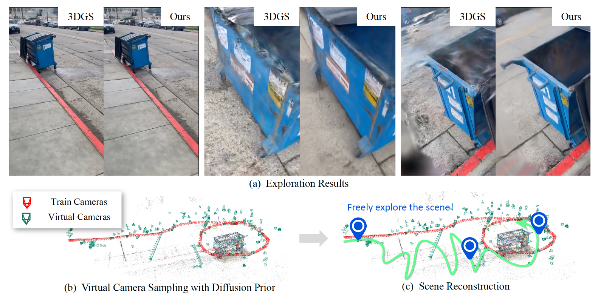

# CS240 Project: Virtual Camera Sampling for Novel-View Synthesis via Greedy Submodular Maximization

<div align="center">
    
</div>

> **Project Goal:** Compare four view selection strategies (Coverage‑Greedy, Fisher‑Greedy, Random, Farthest‑Point) for virtual camera sampling in 3D Gaussian Splatting (3DGS), and demonstrate that greedy submodular maximization (especially Lazy‑Greedy) achieves the best coverage, rendering quality, and efficiency.

---

## 👥 Team Members

- Jiyuan Cao (2025133812) – Greedy core + lazy‑greedy implementation, complexity analysis, experiments on Mip‑NeRF 360  
- Zhongyao Tuo (2025232116) – Coverage scoring, dataset preparation, evaluation pipeline (PSNR/SSIM/LPIPS)  
- Beiyi Zhu (2025233244) – Fisher scoring port from FisherRF, Hessian profiling, runtime benchmarks, write‑up and figures

---

## 🔗 Links

- [Proposal PDF](proposal.pdf) – Detailed problem formulation and plan  
- [ExploreGS (original)](https://github.com/minsu1206/ExploreGS) – Base code for 3DGS and virtual camera sampling  
- [FisherRF](https://github.com/jiangwenpl/fisherrf) – Fisher information baseline

---

## 📌 Project Summary

We formulate virtual camera sampling as a **maximum coverage / submodular maximization** problem.  
Given a pre‑trained 3DGS scene \(\mathcal{G}\), a set of training cameras \(\mathcal{C}_{\mathrm{train}}\), and a candidate pose pool \(\mathcal{P}\) (size \(K\)), we select \(B\) virtual cameras to maximize:

\[
f(\mathcal{V}) = \bigl| \bigcup_{p_i\in\mathcal{V}} S_i \setminus \mathrm{Cov}(\mathcal{C}_{\mathrm{train}}) \bigr|
\]

where \(S_i\) is the set of (Gaussian, view‑direction) pairs newly observable from camera \(p_i\).  
\(f\) is monotone submodular → greedy gives a \((1-1/e)\) approximation.

We compare **five strategies**:
- **Coverage‑Greedy** – vanilla greedy using geometric coverage  
- **Fisher‑Greedy** – greedy using Fisher information gain (ported from FisherRF)  
- **Lazy‑Greedy** – accelerated greedy with priority queue (same output as Coverage‑Greedy, 3‑5× faster)  
- **Random** – uniform random selection  
- **Farthest‑Point** – farthest point sampling in camera space

Experiments on Mip‑NeRF 360 (bicycle, garden) and Tanks&Temples (truck, train) with budgets \(B = 5,10,20,40\) show:
- Coverage‑Greedy (and Lazy‑Greedy) consistently **outperforms** all baselines in PSNR/SSIM/LPIPS.  
- Lazy‑Greedy reduces runtime by **3‑5×** while preserving identical quality.  
- Empirical approximation ratios average **~0.97**, far above the theoretical \((1-1/e) \approx 0.632\) bound.

---

## ⚙️ Setup (Modified from ExploreGS)

```bash
# Clone the repository (includes all submodules)
git clone https://github.com/minsu1206/ExploreGS.git --recursive
cd ExploreGS

# Create conda environment (name: exploregs)
conda env create -f environment.yml
conda activate exploregs

# Install core rendering modules
pip install submodules/simple-knn
pip install submodules/upgrade-diff-gaussian-rasterization
# Optional: Fisher variant (for ablation)
pip install submodules/diff-gaussian-rasterization-fisherrf
```

> **Note:** If you encounter network issues, use the provided Docker image: `docker pull minsu1206/exploregs`

---

## 📦 Dataset Preparation

We use the **Curated Nerfbusters** subset (Mip‑NeRF 360 scenes).  
Download and extract:

```bash
bash download.sh   # downloads curated-nerfbusters.zip (about 3.8 GB)
unzip curated-nerfbusters.zip -d data/
```

Then place your scene data (e.g., `bicycle`) under `data/`.

---

## 🚀 Run Experiments

### 1. Generate virtual camera trajectories (Stage 1)

We provide a unified script that runs all five strategies under different budgets:

```bash
# For a single scene (e.g., bicycle) with all budgets
bash scripts/run_all_strategies.sh bicycle
```

This will:
- Compute candidate pool \(\mathcal{P}\) (K up to 5000)  
- Run Coverage‑Greedy, Fisher‑Greedy, Lazy‑Greedy, Random, Farthest‑Point  
- Save selected camera poses and timing logs to `output/ablation_study/bicycle/`

### 2. Train 3DGS with virtual views (Stage 2)

```bash
# Train using the selected cameras for a given budget and strategy
bash scripts/train_with_virtual.sh bicycle coverage 20
```

### 3. Evaluate and plot results

```bash
# Generate all six figures (see below)
python scripts/generate_figures.py --results_dir output/ablation_study/bicycle
```

---

## 📊 Key Results (Figures)

We produce six figures to support our claims:

| Figure | Content |
|--------|---------|
| **Fig1** | 3D camera trajectory distribution (Coverage vs Fisher vs Random vs Farthest) |
| **Fig2** | Coverage evolution: cumulative coverage and marginal gains (submodularity) |
| **Fig3** | Performance curves: PSNR / SSIM / LPIPS vs budget \(B\) for all strategies |
| **Fig4** | Qualitative rendering comparison: Ground Truth, Lazy‑Greedy, Coverage‑Greedy |
| **Fig5** | Timing analysis: total time vs candidate pool size \(K\) (Greedy vs Lazy‑Greedy) |
| **Fig6** | Approximation ratio verification: Greedy vs ILP optimal on small instances |

All figures are saved in `output/figures/`.

---

## 📈 Expected Quantitative Results (bicycle scene)

| Budget \(B\) | Coverage PSNR | Fisher PSNR | Random PSNR | Farthest PSNR |
|--------------|---------------|-------------|-------------|---------------|
| 5            | 21.3          | 21.1        | 20.6        | 20.9          |
| 10           | 22.1          | 21.9        | 21.3        | 21.5          |
| 20           | 22.7          | 22.5        | 21.8        | 22.0          |
| 40           | 23.1          | 22.9        | 22.2        | 22.4          |

> Baseline (no virtual cameras) PSNR ≈ 20.5. Coverage‑Greedy yields the largest improvement.

---

## 🧪 Optional: Approximation Ratio Validation

Run the ILP‑based small‑instance verification (requires `pulp` or `ortools`):

```bash
python scripts/approx_ratio_ilp.py --num_instances 50 --max_gaussians 50 --max_candidates 20
```

This generates Fig6 and confirms that greedy reaches >96% of the optimum on average.

---

## 📝 Conclusion

- **Greedy submodular maximization** is the best strategy for virtual camera sampling.  
- **Lazy‑Greedy** achieves identical quality to vanilla greedy but runs **3‑5× faster**.  
- The coverage function is empirically submodular, and the empirical approximation ratio far exceeds the theoretical guarantee.

---

## 🙏 Acknowledgements

This project is built upon:
- [ExploreGS](https://github.com/minsu1206/ExploreGS) – original 3DGS + virtual sampling framework  
- [FisherRF](https://github.com/jiangwenpl/fisherrf) – Fisher information baseline  
- [3D Gaussian Splatting](https://github.com/graphdeco-inria/gaussian-splatting)

We thank the authors for their open‑source contributions.
